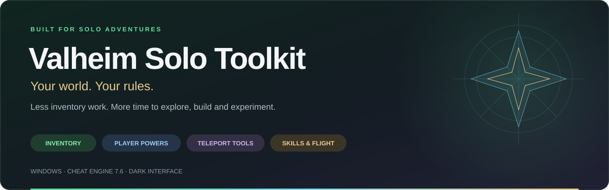

  

  A dark, easy-to-use Cheat Engine toolkit for your solo Valheim world. 
  Manage your inventory, tune your skills and make the next adventure your own.

  <a href="Valheim%202026%20CT.CT"><strong>Download the table</strong></a>
  &nbsp; · &nbsp;
  <a href="#quick-start">Quick start</a>
  &nbsp; · &nbsp;
  <a href="#watch-it-in-action">Watch it in action</a>
  &nbsp; · &nbsp;
  <a href="#a-few-useful-details">Useful details</a>

 

## Quick start

**You need:** Windows, Cheat Engine 7.6 and Valheim running with Mono support.

1. Download **[Valheim 2026 CT.CT](Valheim%202026%20CT.CT)**. On GitHub's file page, use **Download raw file**.
2. Start Valheim and load your world.
3. Open the table in Cheat Engine and allow its Lua script to run.
4. The toolkit finds Valheim and loads your inventory automatically.

Not in your world yet? It quietly retries every **3 seconds** until the first load succeeds. There is no need to choose the process manually.

The **green Refresh inventory** button reloads your items whenever you need it. Hover over any action for a quick explanation, or open **Help & tips** for the full guide.

 

## Watch it in action

> 🎬 **YouTube walkthrough — coming soon**
> A tour of the interface, inventory tools and everything you can do in your world.

<!-- When the video is ready, replace the callout above with:

Replace both instances of VIDEO_ID with the actual YouTube video ID.
-->

 

## 🟢 Make inventory management effortless

Select an item, choose an action and get back to playing.

| Tool | What it does |
| :--- | :--- |
| **Edit quantity** | Set a stack to the amount you want, including above its normal limit. |
| **Clone an item** | Copy a selected item into your inventory. Leave an empty slot available. |
| **Max all stacks** | Fill existing stacks to their normal limits. Overstacks are reduced to those limits. |
| **Freeze quantities** | Hold one stack or all current stacks at their chosen quantities. An **X** shows what is frozen. |
| **Auto refill** | Ctrl + left-click a stack into an open chest. A copy transfers while the original stays in your slot. |
| **Delete items** | Enable the bottom-left in-game menu, drag a full stack from your inventory, then destroy and confirm. |
| **Item flags** | One **Clear all flags** toggle clears the entire inventory immediately and keeps carried-item flags clear while enabled. |

**Freeze selected** toggles the selected stack; **Freeze inventory** becomes **Unfreeze inventory** while any lock is active. Freezing captures the stacks you have now. New items and newly split stacks start unfrozen. Use **Auto refill** when you want to deposit an entire stack and keep the original.

 

## 🟡 Build freely. Carry more. Keep going.

| Player tool | What it does |
| :--- | :--- |
| **God mode** | Blocks damage to your local player. |
| **Unlimited stamina** | Replenishes stamina while enabled. |
| **Rapid miner** | Speeds up pickaxe swing animations to 10×, refills stamina and keeps the equipped pickaxe at full durability. |
| **Rapid hoe** | Hold use to repeat hoe terrain actions up to 20 times per second, with stamina refill and full hoe durability. |
| **Building tools** | Auto-build snapped rows, capture furnished blueprints, preview/rotate/paste saved structures, and undo the last paste. |
| **Enemy form** | Choose from 26 creature forms with native movement and attack weapons, including Sea Serpent, Fuling Berserker, Cultist, Abomination and Asksvin. |
| **Free crafting** | Bypasses crafting and building material requirements. |
| **Unlimited carry** | Prevents encumbrance, even when you exceed the normal weight limit. |
| **Kameha** | The original cyan bow beam, with swirling particles, wind ribbons and bright impact effects. Targets hostile monsters. |
| **Death Beam** | Evil crimson/purple bow beam that penetrates terrain, excavates trenches and damages creatures, buildings, trees and rocks along its full 80m path. |
| **Spirit Bomb** | Huge blue-white sphere moving at 9m/s, with orbiting energy rings and an expanding 40m-radius blast. |
| **Supernova (Frieza)** | Giant orange/crimson sphere moving at 6m/s, with a 120m-radius explosion that damages loaded objects and excavates nearby ground. |

Click **DBZ Powers** and choose **1 Kameha**, **2 Death Beam**, **3 Spirit Bomb**, or **4 Supernova (Frieza)**. Equip a bow; hold Mouse 1 for beams or click to launch a bomb. Toggle off before changing powers. All powers replace ordinary bow shots and have local visuals. Kameha retains its original hostile-monster-only targeting and stops at terrain/buildings.

**Kayoken:** Enable a DBZ power, equip your bow, then check **Kayoken** beside the DBZ button. A pulsing red aura, rising red flames and red light surround your character. Kayoken applies **32× damage**, doubles beam width and bomb size/blast radius, and extends beam reach to **120m**. Kameha remains hostile-monster-only at **3,200 lightning damage per tick**. Death Beam dispatches **16,000 generic damage per 0.1-second tick**, plus 16,000 chopping/pickaxe damage, to creatures, pets, players and destructible objects along its path, excluding the caster. Native damage/PvP/protection rules still apply; terrain uses native excavation, not hit-point damage. Death Beam excavates three parallel lanes while retaining the six-operation terrain budget per tick.

Kayoken Spirit Bomb deals **160,000** generic damage with an **80m blast radius**; Supernova deals **640,000** with a **240m radius**, plus chopping/pickaxe damage. Damage and terrain still affect loaded objects/terrain and are processed in bounded batches. Bombs snapshot Kayoken at launch; unchecking changes beams and future launches, not a bomb already in flight. Unchecking removes the aura; disabling DBZ Powers, closing the toolkit or leaving the world resets the checkbox and cleans up effects. Aura visuals are local. Compilation, damage/terrain dispatch and checkbox lifecycle tests pass; live aura appearance and expanded blast performance remain unverified.

Bombs detonate on collision or after 20 seconds of flight. Spirit Bomb starts with a 12m core and deals 5,000 generic damage plus chopping/pickaxe damage; Supernova starts with an 18m core and deals 20,000. Their glow shells and orbiting rings extend beyond the core. Explosions expand over three seconds and fade over six. The caster is excluded from direct damage, but other creatures, pets and destructible objects are included, subject to native damage/PvP rules.

**Supernova spans 240m across**, within the loaded world around the impact. It does not destroy the whole map or force distant areas to load. Each destructible is hit once per blast, with damage and native pickaxe terrain impacts processed in batches. Large craters can take tens of seconds to finish; the toolkit status shows progress. One bomb can be active at a time. Toggle **OFF** or close the toolkit to cancel pending flight/blast work on the next game update; completed destruction remains. Death, teleporting or leaving the world also cancels it. Menus and loss of focus suspend processing. Native terrain depth and protected-area restrictions still apply; airborne explosions only dig ground inside the blast sphere.

The window title includes **DBZ Powers v2**. Disable the previous power and unpause before reloading. Compilation, selection/cleanup tests, damage dispatch and blast-layout tests pass; the new visuals, collisions and large-area performance still need live game verification.

Death Beam applies 500 generic damage plus chopping/pickaxe damage every 0.1 seconds to destructible objects along its full 80m path. The caster is excluded, but pets, structures and other creatures are included; normal game damage rules, immunities and PvP rules still apply. Multiple colliders on the same destructible receive one hit per tick.

**Death Beam excavates terrain permanently.** It sends native terrain-lowering operations along the beam in bounded sweeps while firing. Valheim's heightmap creates open trenches, not enclosed underground tunnels, and normal terrain depth limits remain. Releasing stops new operations; already submitted edits remain. Terrain edits and damage affect the world even though the beam visuals are local. Compilation and automated damage/excavation tests pass; live visuals, terrain editing and multiplayer behavior still need an in-game check.

**Death Beam v2 excavation fix:** Ground impacts now use the iron pickaxe's registered terrain prefab through the game's normal pickaxe-impact routine. The previous temporary terrain object was discarded because this game version transmits only registered prefab names. Aim at or into the ground and hold fire; repeated sweeps dig down from the current surface. Normal pickaxe depth and area restrictions apply. Disable the old beam before reloading; this fix is included in **DBZ Powers v2**.

Enable **Rapid miner** in **Skills and movement**, equip a pickaxe, and hold attack. Switching to another tool stops its effects. Normal mining range, hit detection and pickaxe tier requirements still apply. Disable it to restore normal animation speed; refilled stamina and durability remain. The separate Unlimited stamina toggle works independently. The 10× setting controls animation speed, not a guaranteed tenfold ore yield.

Enable **Rapid hoe** beside Rapid miner, equip the hoe, choose its terrain action and hold the use button (mouse attack or controller place). Release to stop repeating. Normal terrain restrictions and material costs still apply, including stone for raising ground. Switching tools or disabling restores the original placement cooldown. Refilled stamina and durability remain. It can run alongside Rapid miner; each affects only its own tool.

**Building v2** has its own row in the toolkit. Open **Building tools**, enable **Auto rows**, equip the hammer and select a straight floor, wall or horizontal beam. Start from a valid placement preview, hold **Ctrl + left mouse**, and aim along the row. Release **left mouse while still holding Ctrl** to place it. Right-click or Escape cancels; releasing Ctrl before the mouse also cancels. Tool/selection changes, menus and loss of focus cancel pending work. Already placed pieces remain.

The translucent previews use the piece's meshes and aligned snap points, lock to its horizontal X/Z axes, and cap each row at 24 pieces. Release to automatically build at those exact positions, four pieces per frame. Once the starting placement is valid, the row does not recheck line of sight, player reach, snapping, collision or hammer cooldown, so you can stay where you started. The preview is the placement plan: avoid running it through existing structures. Native piece creation retains creator/network setup, placement effects and structural support; unsupported pieces can still collapse. Direct row placement uses the game's cheat marking unless its bypass setting is active.

With **Free Crafting ON**, rows consume no materials, stamina or hammer durability. With it off, each piece checks the normal materials/station, stamina and hammer requirements and pays the normal costs; the row stops if these run out. World free-build material settings are respected. Drag build does not enable Free Crafting automatically. Irregular/sloped pieces and vertical stacking remain unsupported.

Drag build and Rapid Hoe share the game's placement callback, so enabling either turns the other off. The toolkit title includes **Building v2**. Compilation, row geometry and UI/hook lifecycle tests pass; live snapping, previews and placement still need an in-game check.

**Furnished blueprints (Building v2):** Stand inside the building at floor level, then open **Building tools → Capture furnished blueprint**. Enter a save name and box dimensions (width, height, depth; 2-80m each). Return to Valheim with your hammer once so the capture runs. The box is centered on your character's world position at that moment, starts **1m below your feet**, and extends upward. It captures loaded player-built pieces whose origins lie inside that box, up to 512 pieces. The selection and serialized snapshot stay fixed afterward: breathing, camera motion and later movement do not change the count. Re-capture with different dimensions or from a different standing position to adjust it.

When the status says **Captured N pieces**, click **Save captured blueprint** in the Building window. Saving reads the frozen data, so it works while Cheat Engine has focus and Valheim is paused. It verifies the written file and displays its full path. No F6/F7 sequence is needed for capture; F7 remains an optional save shortcut in game. Existing names get numbered suffixes instead of failing or overwriting earlier files. Cancel preview retains a ready capture for saving; another Capture/Load, disabling tools or leaving the world clears it. Files are stored under `%LOCALAPPDATA%\ValheimSoloToolkit\Blueprints`.

Choose **Load blueprint / preview**, enter a saved name, and return to the game. The preview follows the hammer placement ghost for anchoring/snapping, with an aimed-surface fallback. Q/E rotate in 15-degree steps, Page Up/Down adjust height by 0.5m, F6 locks/unlocks the preview, and F7 builds it. Saved pieces retain their relative positions and rotations. They are placed from lower to higher positions in batches without chasing or line-of-sight checks. Free Crafting skips materials, stamina and hammer wear. Otherwise the full material bill is checked before starting, each piece pays costs, and depleted stamina/durability or lost requirements stop the remaining work. Unsupported pieces may collapse, and overlaps are not prevented.

Blueprints include furniture, beds, containers, lights, crafting stations, decorations and sign text. Containers start empty, beds unclaimed, portals unlinked, and item/armor stands empty. Terrain, loose items, creatures, stored inventory, fuel state, displayed equipment and other object-specific settings are not copied. The tools reconstruct registered piece prefabs rather than duplicating world-object data. These direct placements retain the game's cheat marking unless its bypass setting is active.

**Undo last blueprint paste** removes only the exact network objects created by the most recent paste, including a partial paste. It does not delete the original building or other nearby pieces, and does not refund materials. Empty any pasted containers and remove newly displayed equipment before undoing them. Return to the pasted structure if a piece has left the loaded area. Cancelling previews preserves Undo; starting another paste replaces it. Disabling Building, switching to Auto rows/Rapid Hoe, closing the toolkit or changing worlds clears Undo history. Blueprint files remain in `%LOCALAPPDATA%\ValheimSoloToolkit\Blueprints` as `.vbp` files. Capture/load previews, placement, sign restoration and Undo are experimental and still need live game verification; compiler, persistence validation and mocked UI/lifecycle tests cover the offline checks.

**Enemy form** is under **Skills and movement**. Finish any attack or teleport, click the toggle, choose a form, then return to Valheim and unpause. Your original player is hidden and suspended while you control a newly spawned enemy body. This is an experimental solo feature; compilation and mocked tests pass, but live camera, animations and combat still need an in-game check.

**Turning fix (v5):** Forms face the movement direction while moving, and follow camera aim while idle or attacking. Facing updates no longer restart an unfinished look transition every frame. The game still applies each creature's native turn speed and attack restrictions. Return from any active form and unpause before reloading the updated table.

**Expanded roster (v6):** The original six choices keep their numbers. Added forms use the same turning controls, identity hiding and F8 return. Large creatures need open space; native area attacks can affect nearby objects. Added forms are experimental and still need in-game checks. Missing or incompatible prefabs cancel before suspending the player.

| Number | Form | Number | Form |
| :--- | :--- | :--- | :--- |
| 1 | Greydwarf | 14 | Blob |
| 2 | Skeleton | 15 | Oozer |
| 3 | Draugr | 16 | Surtling |
| 4 | Wolf | 17 | Fenring |
| 5 | Troll | 18 | Cultist |
| 6 | Sea Serpent | 19 | Fuling |
| 7 | Greyling | 20 | Fuling Berserker |
| 8 | Neck | 21 | Fuling Shaman |
| 9 | Greydwarf Brute | 22 | Lox |
| 10 | Greydwarf Shaman | 23 | Seeker Brood |
| 11 | Draugr Elite | 24 | Seeker Soldier |
| 12 | Draugr Archer | 25 | Abomination |
| 13 | Rancid Remains | 26 | Asksvin |

**Sea Serpent** is option **6** in Enemy form. Transform in deep water with room for the body. Normal movement steers its native surface swimming, and Attack uses its native attack weapon. This transforms you at your current location; it does not teleport you to an existing serpent or automatically find the ocean. F8 returns your player at the serpent’s last position, including in water. Return to your player and unpause before loading the new table; the window title should show **Enemy form v6**. Sea Serpent still needs an in-game check.

The transformation waits for Valheim to initialize the enemy's native weapons before suspending your player, including built-in unarmed attacks. If no attack becomes available within three seconds of game time, it cancels and leaves your player unchanged. The V2 helper fixes the early “no usable native attack weapons” error; reload the updated table to load the new helper even in an existing game session.

**Enemy form v6** also hides your player nameplate and local map/minimap position markers, temporarily blanks the player's network display name, and turns off shared map position. Returning restores your original display name and map-sharing preference. Other players' markers and nameplates are unaffected. This remains a solo-oriented transformation: it does **not** guarantee that other clients see only the enemy model, and shared-map changes depend on normal network updates. Your account and saved character-profile name are not changed.

| Enemy-form control | Action |
| :--- | :--- |
| Normal movement, run and jump bindings | Use the enemy's native movement; keyboard and controller inputs are supported. |
| Attack | Use its currently equipped native attack weapon. |
| Secondary attack or Block | Use the weapon's secondary attack, or its primary if none exists. |
| Use / interact | Cycle the enemy's available native weapons. Different forms have different attack sets. |
| **F8** or click the toggle again | Return to your player at the enemy body's last position. |

The enemy body belongs to the player faction and uses its own health. Its death returns you to your original player. Inventory, skills and original health stay with your player; the ordinary HUD still represents that player, so check the toolkit status for enemy health and the selected weapon. Menus or lost game focus stop movement and new attacks. Normal building and interaction controls are unavailable while transformed.

Returning restores the original camera anchor, visibility, collision and controls, and removes the spawned body. Closing the toolkit also queues restoration: **return to Valheim and unpause for cleanup to finish**. Choose another form by returning first, then enabling the toggle again.

> [!IMPORTANT]
> **God mode and Free crafting can affect item flags.**
> Killing monsters with an item while God mode is enabled can flag that item as cheated. Crafted or upgraded items can also receive the flag when using Free crafting.
> Select the affected item and use **Item flags → Clear selected flag**, then **drop it and pick it up again**. Use the normal drop action, not Inventory delete.
> **Keep item flags off** continuously clears flags on carried items.

 

## 🔵 Choose your skills. Change how you move.

**Set custom skill level** opens a dedicated skill window. See current levels, check individual skills—or **Select all**—enter a level and click **Apply level**.

- **Max skills to 100** brings all existing skill entries to the normal maximum.
- **Custom levels** let you go above 100. Unchecked skills stay unchanged.
- **Movement speed** adjusts how fast you walk, run, crouch and swim.
- **Jump force** gives your jumps more height.
- **Flight** lets you rise with **Space**, descend with **Left Ctrl** and move faster with **Shift**.
- **Reset speed and jump** restores the original movement values.

Changing a skill level resets that skill's progress toward the next level. Higher-than-normal levels may still be limited by the game's own calculations. Flight does not disable collisions.

 

## 🟣 Turn your map into a travel menu

Open **Teleport tools** to choose where you want to go next.

| Destination | How to use it |
| :--- | :--- |
| **Map marker** | Create a named marker on Valheim's map. Click **Refresh locations**, select it and **Teleport selected**. |
| **Map ping** | Ping a location in the game, then refresh while the ping is visible. Select its **Ping** row and teleport. |
| **Saved location** | Stand still and click **Save current position**. Name the spot and return whenever you like. |
| **Coordinates** | Enter **X Y Z**. **Y** is height. |
| **Another player** | They must enable **Visible to other players** on their map. Click **Refresh players**, select them and teleport. |
| **Last death** | Teleport to your character's last recorded death in the current world, even after retrieving or moving the tombstone. |
| **Teleport to tombstone** | Teleport beside your latest remaining tombstone, matched by character ID. |
| **Bring tombstone to me** | In solo play or as the host, move your latest tombstone beside you with its inventory intact. Stand on open, solid ground. |

Saved locations are local bookmarks for each world; they do not create markers on the in-game map. Map and ping destinations use the coordinates captured when you refresh. Player destinations use the latest shared position when clicked, with a small sideways offset.

Return to the game and unpause after queuing a teleport. Give the destination time to load. **Cancel queued** cancels a waiting request; it does not undo an accepted teleport.

Tombstone recovery moves the existing object and its spawn point; it does not duplicate items or target another character's tombstone. The original death location remains unchanged. An open tombstone cannot be retrieved. Remote clients may not know distant tombstone locations: use **Last death** in that case. **Bring tombstone to me** requires solo play or hosting because it needs authority over the world's stored objects. Searches run in batches while the game is unpaused.

After dying, finish respawning and wait until you can move, then click the recovery action. Requests queued before death are cancelled; clicking again uses your new player object. Recovery v2 fixes the player-reference argument that could falsely report a player/world change after respawn.

 

## A few useful details

<strong>What do the inventory indicators mean?</strong>

**X** means the stack quantity is frozen. In the flag column, **Y** means marked as cheated, **–** means clear and **?** means unreadable. The item-flag tools manage these flags; they do not erase every record of cheat use.

<strong>Can I delete part of a stack?</strong>

Split the amount you want to remove into its own slot first, then delete that full stack. The delete menu blocks equipped items, quest items, chest items and partial-stack drags. Confirmed deletion is permanent.

<strong>Does Free crafting also fill machines?</strong>

No. It bypasses crafting and building requirements. Machines and other objects that consume fuel still need their fuel items.

<strong>Does Unlimited carry add inventory slots?</strong>

No. It removes encumbrance. Slot count, displayed weight and the normal weight limit remain unchanged.

<strong>What happens when I close the toolkit?</strong>

Closing the toolkit stops its active toggles and quantity freezes. It does not undo quantity edits, skill edits, cloned or deleted items, or saved bookmarks.

<strong>Do I need the separate DLL files?</strong>

The table contains its Lua script and embedded helpers. Use **Valheim 2026 CT.CT** to run the toolkit. The separate Lua and C# files are available for reviewing or modifying its implementation.

Source lives in `outputs/`. From the repository root, build the mining helper with `pwsh -File work/build-miner.ps1` (use `-Managed` for a different Valheim managed-assembly folder), run `python work/run-lua-tests.py`, then package with `python work/package.py`. The Lua tests use Cheat Engine's Lua DLL; the C# behavior tests use mocks. Live mining speed and animation still require an in-game check.

Build and test the hoe helper with `pwsh -File work/build-hoe.ps1`, then run the same Lua tests and packaging command. Its cooldown, input guards and cleanup have automated coverage; live terrain behavior still requires an in-game check.

Build and test enemy transformation with `pwsh -File work/build-enemy-form.ps1`, then run the Lua suite and packaging command. Its C# source is `outputs/ValheimEnemyForm.cs`; the table embeds the helper DLL, so players still only need the `.CT` file.

 

---

  <strong>Explore a little further. Build something bigger. Have fun.</strong> 
  An unofficial community toolkit for solo play. Not affiliated with Valheim's developers.

